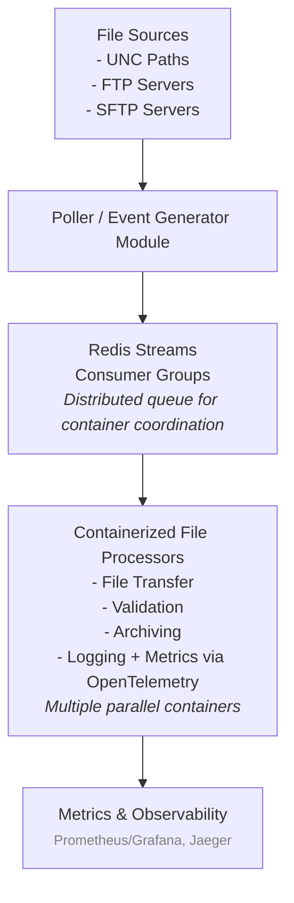

# **FileHorizon**

## **1️⃣ Objective**

Create a lightweight, scalable, containerized Managed File Transfer system to handle file transfers across multiple protocols (UNC, FTP, SFTP) with:

* Reliable detection of fully written files
* Logging and metrics via **OpenTelemetry** (centralized observability; no other logging frameworks)
* Ability to scale horizontally with multiple containers
* Exactly-once processing guarantees for each file
* **Centralized configuration** using **Azure App Configuration** and secrets in **Azure Key Vault**

---

## **2️⃣ Architecture Overview**

---

## **3️⃣ Technology Stack**

| Component                    | Choice                              | Notes                                                                   |
| ---------------------------- | ----------------------------------- | ----------------------------------------------------------------------- |
| **Language & Runtime**       | .NET 8                              | Cross-platform, native UNC/SMB support                                  |
| **File Transfer**            | Custom modules                      | UNC/SMB via `FileStream`, FTP via `FluentFTP`, SFTP via `SSH.NET`       |
| **Distributed Coordination** | Redis Streams                       | Ensure exactly-once processing; consumer groups for multiple containers |
| **Containerization**         | Docker                              | Lightweight, portable, scalable                                         |
| **Orchestration**            | Kubernetes / Docker Compose         | Horizontal scaling, auto-restart                                        |
| **Observability**            | OpenTelemetry                       | Handles logging, metrics, and traces; no other logging frameworks       |
| **Configuration**            | Azure App Configuration + Key Vault | Centralized configuration for all sources, destinations, credentials    |
| **Secrets Management**       | Azure Key Vault                     | Secure storage for credentials and sensitive data                       |
| **File Readiness Checks**    | Custom logic                        | Based on protocol: UNC, FTP, SFTP (see section 5)                       |

---

## **4️⃣ Core Modules**

### **4.1 Poller / Event Generator**

* Polls UNC, FTP, or SFTP sources for new files
* Ensures files are **fully written** before processing:

  * **UNC**: exclusive lock OR size stable for N seconds OR `.tmp` → rename
  * **FTP**: temp filename + rename OR stable size
  * **SFTP**: atomic rename OR stable size
* Adds new file events to **Redis Streams** with a unique identifier

### **4.2 Redis Streams – Distributed Coordination**

* Central queue system for **exactly-once file processing**
* Multiple containers consume from Redis Streams using **consumer groups**
* Files are acknowledged after successful processing to prevent duplicates

### **4.3 File Processor (Containerized)**

* Processes each file event from Redis:

  * **Transfer**: copy/move to target location
  * **Validation**: size, checksum, or schema checks if needed
  * **Archiving**: move to timestamped or configurable archive paths
  * **Logging + Metrics**: all logs, events, and metrics go through **OpenTelemetry**

### **4.4 Configuration Management**

* Centralized configuration stored in **Azure App Configuration**
* Secrets (credentials, keys) stored securely in **Azure Key Vault**
* Allows dynamic updates without redeploying containers

### **4.5 Observability & Telemetry**

* OpenTelemetry handles:

  * **Logging** (all file events, errors, and processing steps)
  * **Metrics** (files processed, errors, transfer durations)
  * **Tracing** (end-to-end file processing)
* Exporters for Prometheus/Grafana or Jaeger

---

## **5️⃣ File Readiness Checks**

| Protocol | Method                                                                   |
| -------- | ------------------------------------------------------------------------ |
| UNC      | Exclusive open OR file size stable N seconds OR temp filename convention |
| FTP      | Temp filename + rename OR size stable                                    |
| SFTP     | Atomic rename OR size stable                                             |

**Optional:** checksum verification for critical files.

---

## **6️⃣ Scaling & Fault Tolerance**

* Multiple containers can consume in parallel from Redis Streams
* Redis ensures **only one container processes each file**
* Retry/backoff logic for transient errors
* Idempotent processing recommended in case of container crashes or reprocessing

---

## **7️⃣ Security Considerations**

* **Credentials:** Azure Key Vault for secrets (SFTP keys, FTP passwords, UNC service accounts)
* **Protocol Security:**

  * SFTP: key-based authentication
  * FTP: FTPS if supported
  * UNC: least privilege access
* **Audit:** All processing logged centrally via OpenTelemetry

---

## **8️⃣ Deployment & Containerization**

* **Containers:** Docker images for File Processors
* **Kubernetes / Compose:** orchestrates scaling, restarts, and resource allocation
* **Configuration:** Mounted Azure App Configuration / Key Vault access
* **Environment Variables:** minimal; mostly for container bootstrap

---

✅ **Summary:**

You now have a fully **containerized, horizontally scalable MFT system** with:

* **Redis Streams** for coordination and exactly-once processing
* **OpenTelemetry** as the sole logging and telemetry system
* **Azure App Configuration + Key Vault** for all configuration and secrets
* Support for **UNC, FTP, and SFTP** with safe file polling
