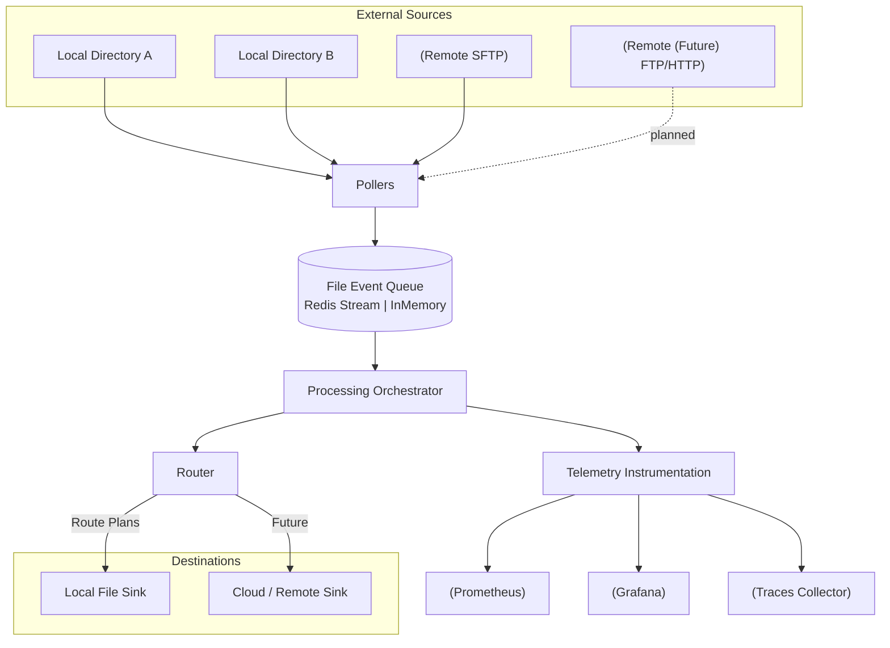
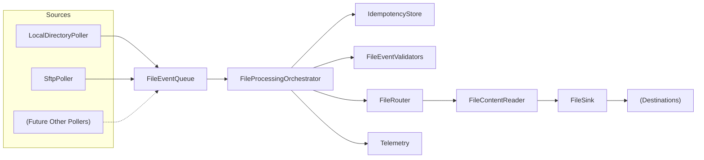
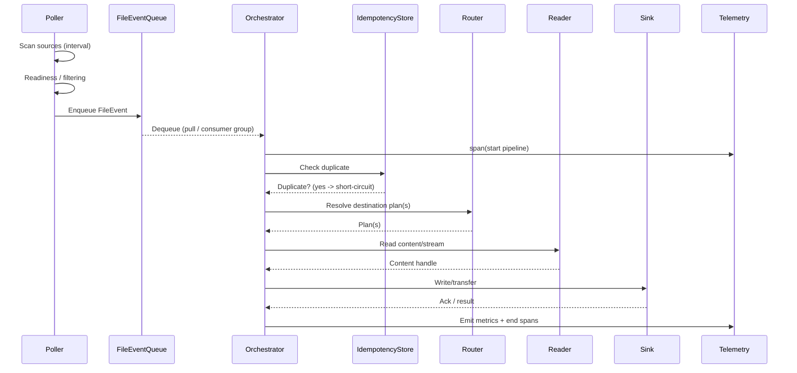
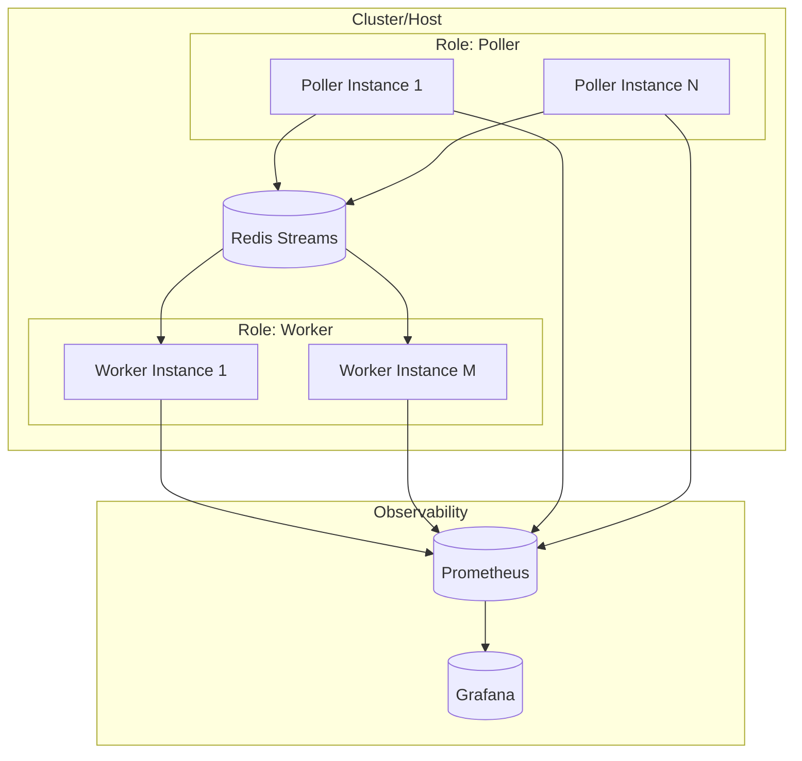
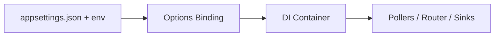
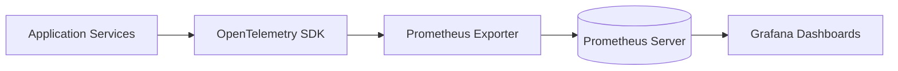

# FileHorizon Architecture Overview

> This document captures the CURRENT architecture of the FileHorizon system. It is descriptive ("what is") rather than prescriptive ("what will be"). For planned enhancements see `NEXT_STEPS.md`.

## 1. Executive Summary

FileHorizon is a modular .NET 8 file ingestion and transfer pipeline. It polls heterogeneous sources (local directories, remote protocols) and delivers files to configured destinations with routing, idempotent processing and rich observability (OpenTelemetry metrics & traces). The solution is structured to evolve toward a clean _Ports & Adapters_ (Hexagonal) architecture and vertical slice feature model.

Key characteristics:

- Layered composition: Thin Host + consolidated Application (Core, Abstractions, Infrastructure, Features, etc.)
- Protocol‑agnostic pollers feeding an internal file event queue (Redis Streams or in‑memory)
- Orchestrated processing pipeline with routing & pluggable sinks
- Idempotency safeguards to prevent duplicate downstream effects
- First‑class telemetry: metrics, spans, gauges, counters, (future) logs
- Configurable deployment roles enabling scale-out of polling vs processing

## 2. Architectural Styles Applied

| Style / Pattern                  | Application In This System                                                                                                      |
| -------------------------------- | ------------------------------------------------------------------------------------------------------------------------------- |
| Layered Architecture             | Host (composition) separated from Application internals (Core, Infrastructure, Features).                                       |
| Ports & Adapters (Hexagonal)     | Interfaces in `Abstractions/` act as ports; implementations in `Infrastructure/` are adapters (pollers, sinks, remote clients). |
| Event-Driven / Stream Processing | File events placed onto internal queue (Redis Streams) consumed by processors.                                                  |
| Vertical Slice Ready             | `Features/` folder reserved for future command/query + handler slices.                                                          |
| Observability-Driven Design      | OpenTelemetry instrumentation integrated at each pipeline stage.                                                                |

## 3. High-Level System Context

The system ingests files from multiple sources, normalizes them into file events, routes and delivers them, emitting telemetry.



Legend: P = Pollers (multi-protocol), Q = Internal queue, O = Orchestrator, R = Router, S\* = Sinks, T = Telemetry exporters.

## 4. Core Logical Components



Namespace / Interface Mapping (illustrative):

- Pollers: `Abstractions/IFilePoller`, implementations under `Infrastructure/`
- Queue: `IFileEventQueue` (+ Redis / InMemory impls)
- Orchestrator: core coordination (ensures readiness, validation, idempotency)
- Router: `IFileRouter` determines destination plans
- Readers: `IFileContentReader` (local, sftp implementations)
- Sinks: `IFileSink` (local sink present; extensible)
- Idempotency: `IIdempotencyStore`
- Telemetry: `IFileProcessingTelemetry`
- Secrets: `ISecretResolver`

## 5. Processing Pipeline (Sequence)



Failure Handling (current): Failures increment counters; retry & dead-letter future enhancements.

## 6. Deployment & Scaling



Scaling approach: Increase poller replicas for source breadth; increase worker replicas for throughput. Redis consumer groups ensure each file event is processed once (idempotency adds safety).

## 7. Configuration & Options

Configuration is centralized via `appsettings*.json` bound to strongly typed option classes (e.g., sources, destinations, routing, transfer settings). Example (trimmed):

```jsonc
{
  "Pipeline": {
    "Sources": {
      "Local": [{ "Path": "./_data/inboxA" }]
    },
    "Destinations": {
      "Local": [{ "Name": "OutboxA", "Path": "./_data/outboxA" }]
    },
    "Routing": [{ "Pattern": "**/*.txt", "Destination": "OutboxA" }]
  }
}
```

Binding Flow:



## 8. Idempotency & Exactly-Once Semantics

Current: A simple key (e.g., source path + maybe timestamp) tracked via `IIdempotencyStore` prevents reprocessing within a window.
Planned: Composite content signature (protocol + path + size + modified time + optional hash) to reduce edge collisions (see `NEXT_STEPS.md`).
Rationale: Protects downstream sinks from duplicate side-effects; complements at-least-once delivery of queue.

## 9. Observability Model

Telemetry surfaces:

- Metrics: poll counts, enqueue successes/failures, processing durations, files processed, failures.
- Traces: Spans per pipeline stage (poll, validate, route, read, sink write)
- (Planned) Additional counters: router.\* , sink.write.failures, activeTransfers gauge



## 10. Security & Secrets

- Secret resolution abstracted via `ISecretResolver` (future: integrate cloud secret store)
- Principle of least privilege for remote access credentials (not stored in code)
- Container: non-root execution (Dockerfile) & minimal surface
- Network boundaries: Redis & telemetry endpoints secured via environment/network layer (implementation dependent)

## 11. Roadmap Snapshot (Abbrev)

| Area          | Implemented               | Planned / Next                   |
| ------------- | ------------------------- | -------------------------------- |
| Local Polling | Yes                       | Enhancements (backoff)           |
| SFTP Polling  | Yes                       | FTP/Other protocols              |
| Queue         | Redis & InMem             | Dead-letter, retry policy        |
| Idempotency   | Basic key store           | Composite signature, TTL mgmt    |
| Routing       | Pattern-based             | Conditional transforms, fan-out  |
| Telemetry     | Core metrics/spans        | Expanded metrics, log enrichment |
| Security      | Basic secrets abstraction | External secret provider         |

For full list see `NEXT_STEPS.md`.

## 12. Quality Attributes Mapping

| Attribute     | Mechanism                                   | Notes                               |
| ------------- | ------------------------------------------- | ----------------------------------- |
| Scalability   | Stateless pollers & workers, Redis Streams  | Horizontal scale out by role        |
| Reliability   | Idempotency store, queue durability         | Retries & DLQ forthcoming           |
| Observability | OTEL metrics/spans, dashboards              | Gaps: sink failure granularity      |
| Modifiability | Ports & Adapters interfaces                 | Future project split eases refactor |
| Testability   | In-memory adapters, interface-driven design | Extensive unit tests in `test/`     |
| Security      | Secret abstraction                          | Hardening pending external provider |

## 13. Risks & Open Questions

| Risk / Question                    | Impact                         | Mitigation / Next Step                        |
| ---------------------------------- | ------------------------------ | --------------------------------------------- |
| Duplicate detection collisions     | Reprocessing side-effects      | Implement composite signature hashing         |
| Lack of retry/DLQ                  | Lost or stuck events           | Introduce retry policy & DLQ stream           |
| Large file handling memory use     | OOM risk                       | Streamed reads; chunked sink writes (planned) |
| Multi-destination fan-out ordering | Partial delivery inconsistency | Transactional plan execution or compensations |
| Security of remote credentials     | Unauthorized access            | Integrate secret provider, rotate credentials |

## 14. Future Evolution & Extraction

Planned project separation:

- `FileHorizon.Domain` (Core logic)
- `FileHorizon.Infrastructure` (adapters)
- `FileHorizon.Application` (orchestration / features)
- `FileHorizon.Host` (composition)

Current folder boundaries already reflect these seams (see `Abstractions/` vs `Infrastructure/`).

## 15. Glossary

| Term              | Definition                                                                 |
| ----------------- | -------------------------------------------------------------------------- |
| FileEvent         | Metadata describing a candidate file to process (path, size, origin, etc.) |
| Poller            | Component scanning a source and generating FileEvents                      |
| Router            | Determines destination plans for a FileEvent                               |
| Sink              | Destination writer/transfer endpoint                                       |
| Idempotency Store | Tracks processed identifiers to prevent duplicate work                     |
| Orchestrator      | Coordinates the processing lifecycle of a FileEvent                        |

## 16. Contribution & Maintenance

When architecture changes:

1. Update relevant code (interfaces, components)
2. Amend this document section(s)
3. Update `NEXT_STEPS.md` & any metric inventory docs
4. Use conventional commit: `docs(architecture): <change summary>`

Checklist before merging architecture changes:

- [ ] Diagrams render (Mermaid)
- [ ] Links valid
- [ ] Terminology consistent
- [ ] Roadmap snapshot aligned with `NEXT_STEPS.md`

## 17. Appendix (Quick References)

Metrics (sample): `files.processed`, `files.failed`, `poller.scan.count`, `queue.enqueue.failures`, `processing.duration.ms`.
Environment variables: Use to override JSON config (e.g., `Pipeline__Sources__Local__0__Path`).

---

Document status: Living document – revise alongside functional changes.
